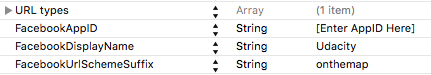

# On The Map

## Overview

- Multi-view Swift app that posts user-generated location information to a shared map and pulls the locations of fellow Nanodegree students with custom messages about themselves
- Built from the Udacity courses _iOS Networking with Swift_ and _Grand Central Dispatch (GCD)_ and integrates MapKit functionality, strict MVC, and various types of REST API calls using NSURLSession

## Screenshots

  .png "Table View (Redacted)")  

## Instructions

In order for the networking calls to work correctly in the app, you will need to do the following:

Assign these variables in the ParseConstants.swift file:

Enter a Facebook App ID in the Info.plist file:

